# High-Performance Arena Allocator


A lightweight, **header-only** linear memory allocator designed for **game engines** and **high-performance real-time systems**. It provides **O(1)** allocation time and ensures **CPU cache locality** by keeping objects in contiguous memory blocks.

Achieves **~19.4x speedup** compared to standard `new`/`delete` operations by eliminating heap fragmentation and allocation overhead.

---

## 🚀 Performance Benchmarks

Benchmarks were conducted allocating **1,000,000 objects** (16 bytes each) in a tight loop.

| Allocator Type              | Average Time (ms) | Relative Speed    |
|:----------------------------|:------------------|:------------------|
| **Standard `new`/`delete`** | 56.40 ms          | 1x (Baseline)     |
| **Arena Allocator**         | **2.90 ms**       | **~19.4x Faster** |

*> Tested on [Intel i7-13650HX] with -O3 optimization.*

### Why is it faster?
* **Full Inlining:** Being header-only allows the compiler to aggressively inline critical paths (`Alloc`, `Reset`), removing function call overhead.
* **Bitwise Alignment:** Uses bitwise `AND` (`&`) operations instead of modulo (`%`) for alignment calculations.
* **No Kernel Switches:** Allocates one large block upfront; subsequent allocations are just pointer arithmetic (no OS syscalls).
* **Cache Locality:** Objects are packed contiguously, dramatically reducing CPU cache misses.

### 📊 Benchmark Results


```mermaid
gantt
    title Allocation Time for 1M Objects (Lower is Better)
    dateFormat X
    axisFormat %s
    
    section Benchmarks
    Standard new/delete (56.40ms) : done, a1, 0, 56.40
    Arena Allocator (2.90ms)      : active, a2, 0, 2.90
```  

## 📦 Features

* **Header-Only:** No build steps or linking required. Just include and use.
* **Fast Core Logic:** Critical path methods are inlined for maximum performance.
* **Type Safety:** `New<T>(args...)` template wrapper ensures correct object construction.
* **RAII Compliant:** Automatically manages the lifecycle of the underlying raw memory block.
* **Move Semantics:** Implements proper ownership transfer (`move constructor/assignment`) to prevent double-free errors.
* **Memory Safety:** Deleted copy constructors prevent double-free errors; Move semantics implemented for ownership transfer.

---

## 🔌 Integration

### Option 1: Direct Include (Easiest)
1. Copy arena_allocator.h to your project's include folder.
2. Include it in your code: 
```c++
#include "arena_allocator.h"
```

### Option 2: CMake (Recommended)
You can include this library in your CMake project using `add_subdirectory`:

```cmake
add_library(ArenaAllocator INTERFACE)
target_include_directories(ArenaAllocator INTERFACE include/)
target_link_libraries(YourGame PRIVATE ArenaAllocator)
```

## 🛠️ Usage

### 1. Basic Allocation
```c++
#include "arena_allocator.h"

struct Player {
    int hp, xp;
    Player(int h, int x) : hp(h), xp(x) {}
};

int main() {
    // 1. Initialize Arena with 1 MB capacity
    ArenaAllocator arena(1024 * 1024);

    // 2. Allocate objects (Zero overhead)
    // Objects are placed next to each other in memory
    Player* p1 = arena.New<Player>(100, 50);
    Player* p2 = arena.New<Player>(90, 20);

    // 3. Reset (Instant deallocation)
    // Moves the offset back to 0. Destructors are NOT called.
    arena.Reset();
    
    return 0;
}
```

### 2. Array Allocation
```c++
// Allocate contiguous array of 50 integers (Constructors NOT called)
int* numbers = arena.AllocArray<int>(50);

// Safe to use like a normal array
numbers[0] = 42;
```

### 3. Marker System (Scope-based)
```c++
// Save current state
auto marker = arena.GetMarker();

// ... Temporary allocations for a specific frame ...

// Rollback memory to the marker state (Freeing temp objects)
arena.ResetToMarker(marker);
```

### 4. Memory Tracking
```c++
size_t used = arena.GetUsedMemory();
size_t total = arena.GetTotalSize();
float usage = arena.GetUsageRatio(); // 0.0 to 1.0

if (usage > 0.9f) {
    // Arena is 90% full, consider resetting or resizing
}
```

## 🎮 Real-World Use Case: Game Loop
```c++
class GameEngine {
    ArenaAllocator frameArena;

public:
    GameEngine() : frameArena(2 * 1024 * 1024) {} // 2MB per frame

    void UpdateFrame() {
        // 1. Allocate temporary data for this frame
        Particle* particles = frameArena.AllocArray<Particle>(10000);
        RaycastHit* hits = frameArena.New<RaycastHit>();
        
        // ... process frame logic ...
        
        // 2. End of frame: Instant cleanup of ALL frame data
        // No need to call delete on particles or hits individually.
        frameArena.Reset();
    }
};
```

## ✅ When to Use / ❌ When Not to Use

| ✅ Ideal Use Cases                          | ❌ Not Suitable For                           |
|--------------------------------------------|----------------------------------------------|
| Per-frame game engine allocations          | Long-lived objects with mixed lifetimes      |
| Temporary simulation / physics data        | Objects requiring deterministic destruction  |
| Transient ECS-style data                   | RAII-heavy resource ownership (files, mutex) |
| Short-lived compiler phases (parsing pass) | Incremental / selective object freeing       |
| Scratch memory for algorithms              | Streaming buffers with wrap-around logic     |

## ⚠️ Important Notes

### Object Lifetime & Destructors

- `Reset()` and `ResetToMarker()` **do NOT call destructors**
- Memory is reclaimed by simply rewinding the internal offset
- This is a **design decision** for performance

### ⚠️ Critical Warning: RAII Types
Do **NOT** store types that manage their own memory (like `std::vector`, `std::string`, `std::map`) inside the Arena unless you manually call their destructors.
- **Good:** `struct Vector3 { float x, y, z; };`
- **Bad:** `struct Profile { std::string name; };` (The string's internal buffer will leak upon `Reset()`)
## 🧠 Memory Layout

```text
[Arena Start] ──────────────────────────────────────> [Arena End]
│  Object A  │ Pad │   Object B   │  Object C  │ Free Space...
↑            ↑     ↑
│            │     └─ Next aligned allocation
│            └─ Padding bytes (for alignment)
└─ Base address
```

## 🔨 Build & Test
This project uses CMake. Ensure you have CMake and a C++20 compatible compiler installed.
```bash
# Clone the repository
git clone https://github.com/FurkanKirat/arena-allocator.git
cd arena-allocator

# Create build directory
mkdir build && cd build

# Configure and Build (Release mode is recommended for benchmarks)
cmake -DCMAKE_BUILD_TYPE=Release ..
make

# Run Tests
./tests/unit_tests

# Run Benchmarks
./benchmarks/benchmark_main
```

## 📚 API Reference
| Method                | Description                                       |
|:----------------------|:--------------------------------------------------|
| **New<T>(args...)**   | Construct object in-place with perfect forwarding |
| Alloc(size, align)    | Allocate raw aligned memory                       |
| AllocArray<T>(count)  | Allocate array (Constructors NOT called)          |
| Reset()               | Clear entire arena in O(1)                        |
| GetMarker()           | Save current allocation position                  |
| ResetToMarker(marker) | Rewind to previously saved position               |
| GetUsageRatio()       | Get memory usage as float (0.0 to 1.0)            |

## 📄 License
This project is licensed under the MIT License - see the LICENSE file for details.

## 🙏 Acknowledgments
Inspired by memory management techniques from:

**Game Engines: Unity (ECS), Unreal Engine**

**Performance Engineering: Casey Muratori, Mike Acton (Data-Oriented Design)**